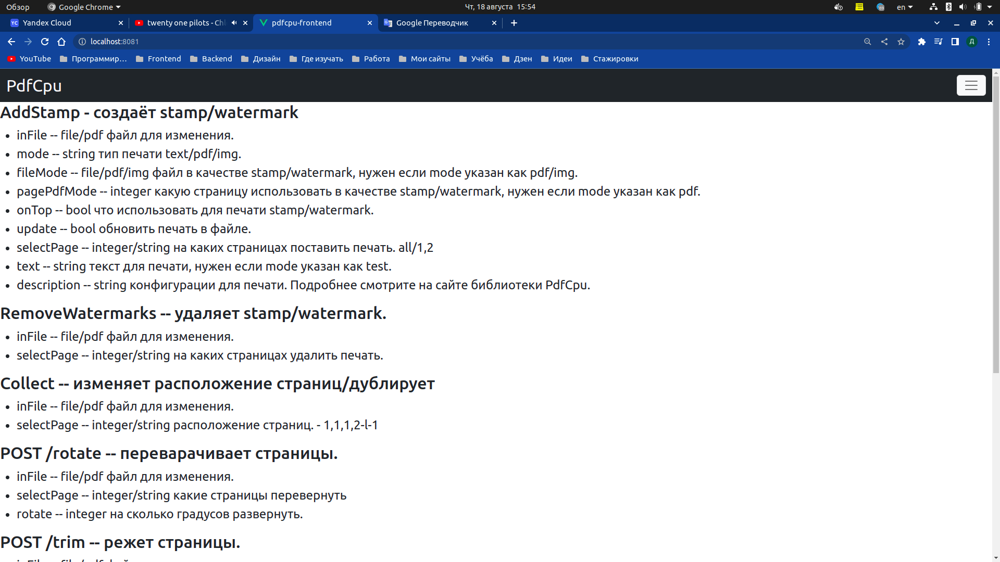
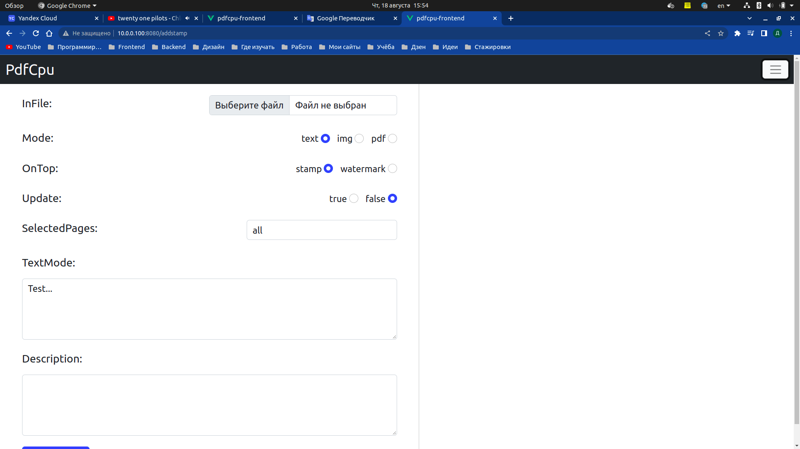
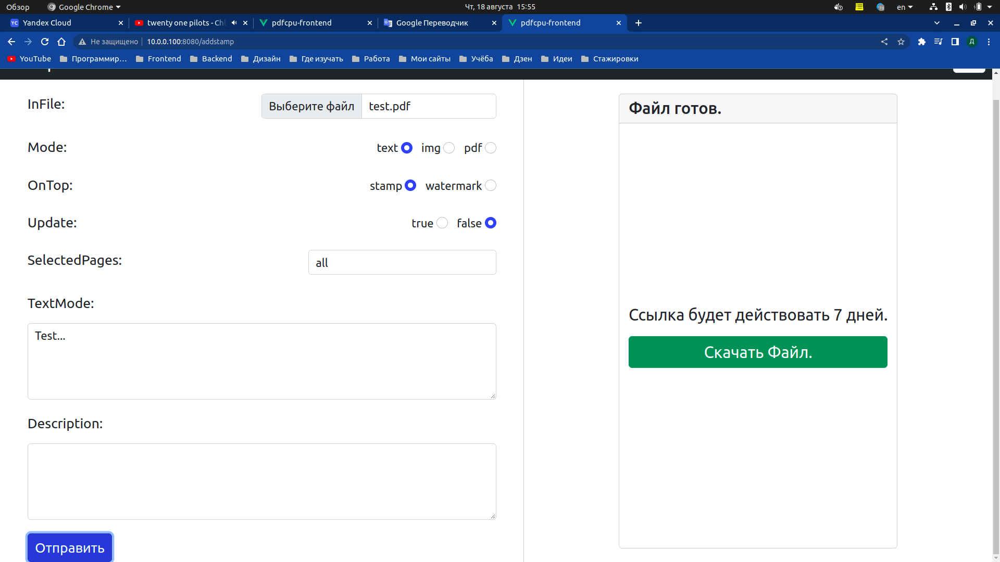
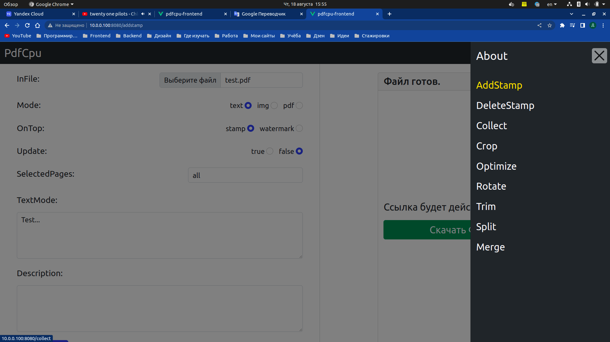

<h1>PDFCPU-RESTAPI</h1>
Проект создан для работы с документами формата pdf. Работает в связки с бэкендом. pdfcpu-RestApi.
<h1>Как запустить проект:</h1>
<ul>
    <li>npm install</li>
    <li>npm run serve</li>
</ul>
</h1>

